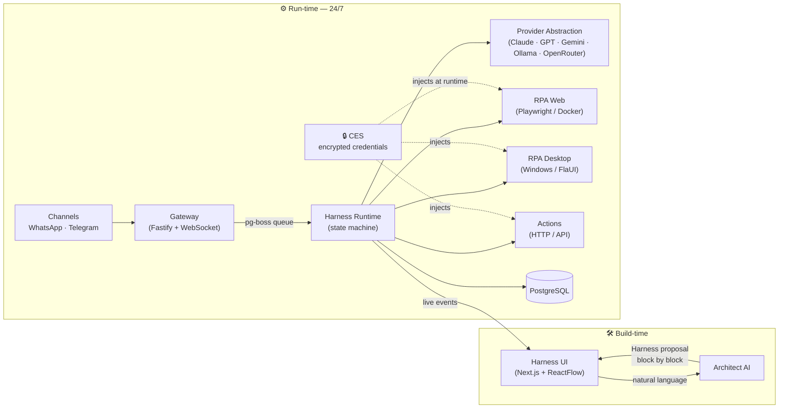

<div align="center">

# RobbIA

### The open-source workbench for the **AI Agent Architect**

*Describe an automation in plain language. An **Architect AI** turns it into a runnable agent — block by block — that you refine, approve, and ship to run 24/7 on your own server.*

[](https://github.com/marcioluiskroth/RobbIA/actions/workflows/ci.yml)
[](LICENSE)
[](#-project-status--roadmap)
[](https://bun.sh)
[](https://www.typescriptlang.org/)
[](CONTRIBUTING.md)

**🇺🇸 English** · [🇧🇷 Português](README.pt-BR.md)

</div>

---

## ✨ What is RobbIA?

**RobbIA** is a self-hosted, MIT-licensed platform for **building and operating conversational AI agents** — without wiring flows node by node and without writing scraping code from scratch.

You describe what you want to automate in natural language. The **Architect AI** decomposes your request into a **Harness** — an ordered sequence of executable **Blocks** (Trigger, Context, Decision, Response, RPA, Action, Verification) — choosing the right AI model for each block and justifying every choice. You review block by block, swap models, ask it to rethink, approve, and publish. The agent then runs **24/7 on your VPS**, reachable over **WhatsApp** and **Telegram**.

> **The defensible core:** automatic **natural-language → Harness** generation, combined with **native RPA** (web *and* native Windows desktop) and **multi-LLM with no lock-in** — all in a single self-hosted product. No one else combines these three.

---

## 🎯 Why RobbIA?

| | Workflow builders<br/>(n8n, Flowise…) | Frameworks<br/>(LangChain, CrewAI…) | Closed no-code<br/>(Zapier, Lindy…) | **RobbIA** |
|---|:---:|:---:|:---:|:---:|
| NL → agent (no manual flow) | ❌ | ❌ | ⚠️ | ✅ |
| Self-hosted / your data | ✅ | ✅ | ❌ | ✅ |
| Native RPA (web + desktop) | ⚠️ | ❌ | ❌ | ✅ |
| Multi-LLM, no lock-in | ⚠️ | ✅ | ❌ | ✅ |
| Professional refine & approve | ❌ | ❌ | ❌ | ✅ |
| Credentials never reach the LLM | ⚠️ | ⚠️ | ❓ | ✅ (CES) |

RobbIA targets the emerging **AI Agent Architect** — the professional who turns business needs into agents in production, with their own signature on the result, not a magic button.

---

## 🧩 How it works — the Harness

A **Harness** is the mother structure that organizes and runs an agent: an ordered sequence of **Blocks** with data flow and error handling between them. The MVP ships **7 Block Types**:

| Block | Role |
|-------|------|
| **Trigger** | Starts the Harness on an event (e.g., an incoming WhatsApp message) |
| **Context** | Retrieves data/history (per-conversation memory) |
| **Decision** | Classifies / reasons (intent, routing, escalate?) |
| **Response** | Generates content for the user |
| **RPA** | Acts on systems **without an API** — web (Playwright) or native Windows desktop |
| **Action** | External command — send a message, call an HTTP/API |
| **Verification** | Validates a result (e.g., LLM reads a screenshot and confirms success) |

Each block can use any **AI Model** from any configured **Provider** — or none (deterministic). Swapping a model in one block never breaks the others.

---

## 🏗️ Architecture



**Monorepo layout** (Bun workspaces + Turborepo):

```
robbia/
├── apps/
│   ├── web/                 # Harness UI — Next.js 16 / React 19
│   ├── gateway/             # Fastify 5 + WebSocket (channel webhooks + live stream)
│   ├── runtime/             # Harness Runtime — durable state machine
│   ├── ces/                 # Credential Execution Service (isolated microservice)
│   ├── rpa-web-worker/      # RPA web worker (isolated Docker, ephemeral)
│   └── rpa-desktop-worker/  # RPA desktop worker (Windows node)
├── packages/
│   ├── shared/              # contracts: Result, retry policy, structured logger, Zod schemas
│   ├── db/                  # Drizzle schema + client (single Postgres access point)
│   ├── architect/ provider/ rpa-core/ rpa-web/ rpa-desktop/ memory/ skills/ channels/
└── workers/
    └── rpa-desktop-host/    # .NET FlaUI helper (Windows UI Automation)
```

Full decisions: [Architecture Decision Record](_bmad-output/planning-artifacts/architecture.md) · [Product Vision & Architecture](docs/product-vision-architecture.md).

---

## 🔒 Security & Privacy

Security is a **P0 design requirement**, not an afterthought:

- **Credentials never reach the LLM.** The **CES (Credential Execution Service)** is an isolated microservice that stores secrets with **envelope encryption (AES-GCM)**, with the master key kept outside the database. Secrets are injected only into the execution worker at runtime — **never** into prompts, logs, or model responses.
- **Structured logging with automatic secret redaction.** The shared logger redacts sensitive keys and safely serializes any value (circular refs, `Error`, `BigInt`, `Map/Set`) — it never throws and never leaks.
- **Irreversible actions require human confirmation.** Mass/external sends, financial postings, and deletions go through a **Trust Engine** confirmation queue with a configurable timeout (default 24h) — never fired blind.
- **Sandboxed RPA.** Web RPA runs in an isolated, ephemeral Docker container with restricted networking; desktop RPA runs in an isolated Windows environment. Screenshots sent to an LLM are captured post-authentication or have sensitive fields masked.
- **Self-hosted & private.** Your data stays on your VPS. **No telemetry** to external servers. A **100% local path** is available via [Ollama](https://ollama.com).

> ⚠️ **Conscious trade-off:** the MVP uses the unofficial **Evolution API** for WhatsApp, which **violates WhatsApp's Terms of Service** and can lead to number bans. Use a dedicated/disposable test number. The channel layer is pluggable to allow migrating to the official Cloud API without rewriting Harnesses.

Found a vulnerability? Please read **[SECURITY.md](SECURITY.md)** for responsible disclosure.

---

## 🧰 Tech stack

- **Runtime / package manager / test runner:** [Bun](https://bun.sh) 1.3
- **Monorepo:** [Turborepo](https://turbo.build) 2 · **Lint/Format:** [Biome](https://biomejs.dev) 2
- **Language:** TypeScript (`strict`, no `any`) end to end
- **Frontend:** Next.js 16 + React 19 (App Router) + Tailwind + shadcn/ui + ReactFlow
- **Backend:** Fastify 5 + WebSocket · queues/jobs via **pg-boss**
- **Database:** PostgreSQL + [Drizzle ORM](https://orm.drizzle.team) (UUID v7, `pgvector` planned for later phases)
- **Validation:** Zod at every boundary (*parse, don't validate*)
- **Deploy:** Docker Compose (Linux core) + a dedicated Windows node for desktop RPA

---

## 🚀 Quickstart

> **Prerequisites:** [Bun](https://bun.sh) ≥ 1.3, Docker (for PostgreSQL), and Node-class tooling. Desktop RPA additionally requires a Windows host (later phase).

```bash
# 1. Install dependencies (resolves all workspaces)
bun install

# 2. Quality gates — all green on a fresh checkout
bun run lint        # Biome (lint + format check)
bun run typecheck   # tsc --noEmit across every package
bun run test        # bun test

# 3. Configure environment
cp .env.example .env   # fill in values; secrets are never committed

# 4. Bring up the core locally (PostgreSQL + web)
docker compose up

# 5. Generate / apply the database schema
bun run --filter @robbia/db db:generate   # generate migration SQL from the schema
DATABASE_URL=... bun run --filter @robbia/db db:migrate   # apply (needs Postgres running)
```

The desktop RPA node is brought up separately:
`docker compose -f docker-compose.yml -f docker-compose.windows.yml --profile windows up`.

---

## 📊 Project status & roadmap

RobbIA is in **active early development**. The product is **fully specified** (PRD, architecture, UX, and a 27-story epic breakdown) and implementation has started on a verified foundation.

**Phase 1 — MVP (Months 1–2)**

- [x] **Foundation:** Bun + Turborepo monorepo, CI, shared contracts (Result / retry / secret-redacting logger)
- [x] **Domain schema:** Harness · Block · Provider · ModelConfig (Drizzle, UUID v7) + Zod schemas
- [ ] Provider Abstraction (5 LLMs, schema normalization)
- [ ] Architect AI — natural-language → Harness
- [ ] Harness Runtime + Test Mode (live, block by block)
- [ ] CES + Trust Engine + 24/7 operation
- [ ] Channels (WhatsApp + Telegram) + generic HTTP Action
- [ ] RPA — web (Playwright) + native Windows desktop (FlaUI)

**Beyond the MVP:** multi-client white-label panel, hybrid memory engine, curated harness marketplace, official WhatsApp Cloud API.

Planning artifacts: **[PRD](_bmad-output/planning-artifacts/prds/prd-robbia-2026-06-14/prd.md)** · **[Architecture](_bmad-output/planning-artifacts/architecture.md)** · **[UX (Design](_bmad-output/planning-artifacts/ux-designs/ux-RobbIA-2026-06-14/DESIGN.md) / [Experience)](_bmad-output/planning-artifacts/ux-designs/ux-RobbIA-2026-06-14/EXPERIENCE.md)** · **[Epics & Stories](_bmad-output/planning-artifacts/epics.md)**.

---

## 📚 Documentation

| Doc | What's inside |
|-----|---------------|
| [Product Vision & Architecture](docs/product-vision-architecture.md) | Vision, concepts, 4-layer technical architecture, security, roadmap |
| [Brand Book](docs/brand-book.md) | Visual identity — robot-flowchart mascot, Graphite + Cyan palette, typography |
| [PRD](_bmad-output/planning-artifacts/prds/prd-robbia-2026-06-14/prd.md) | 22 functional requirements, NFRs, scope, success metrics |
| [Architecture Decisions](_bmad-output/planning-artifacts/architecture.md) | Stack, patterns, project structure, requirement → component map |
| [UX Spec](_bmad-output/planning-artifacts/ux-designs/ux-RobbIA-2026-06-14/EXPERIENCE.md) | Information architecture, states, accessibility (WCAG 2.1 AA), flows |

---

## 🤝 Contributing

Contributions are welcome! Please read **[CONTRIBUTING.md](CONTRIBUTING.md)** and our **[Code of Conduct](CODE_OF_CONDUCT.md)**. In short: TypeScript `strict`, validate boundaries with Zod, never log or expose secrets, and run `bun run lint && bun run typecheck && bun run test` before opening a PR.

## 📄 License

[MIT](LICENSE) © 2026 Marcio Luis Kroth. Free to use, self-host, modify, and distribute.

<div align="center">

---

*Built for the architects who deliver agents in production — with their signature on the result.*

</div>
