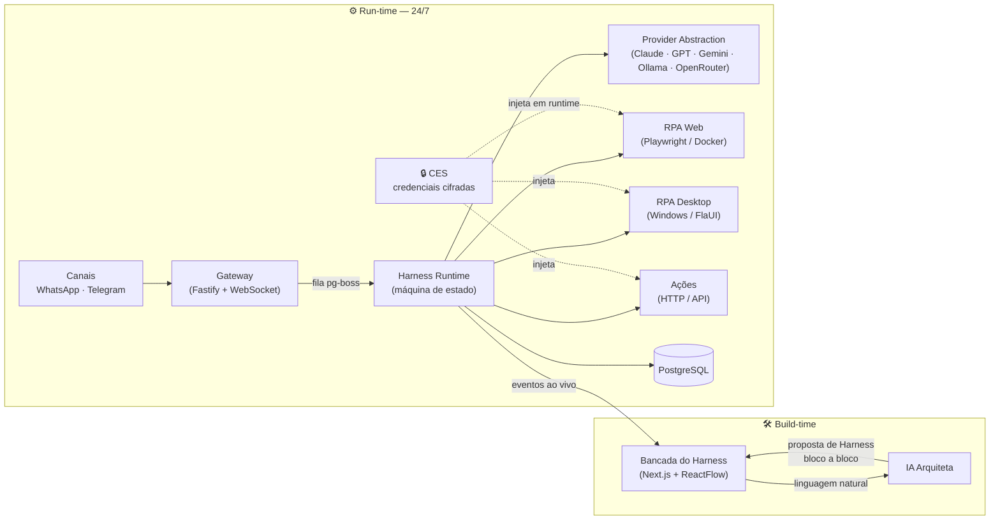

<div align="center">

# RobbIA

### A bancada de trabalho open-source do **Arquiteto de Agentes de IA**

*Descreva uma automação em linguagem natural. Uma **IA Arquiteta** a transforma num agente executável — bloco a bloco — que você refina, aprova e publica para rodar 24/7 no seu próprio servidor.*

[](https://github.com/marcioluiskroth/RobbIA/actions/workflows/ci.yml)
[](LICENSE)
[](#-status-do-projeto--roadmap)
[](https://bun.sh)
[](https://www.typescriptlang.org/)
[](CONTRIBUTING.md)

[🇺🇸 English](README.md) · **🇧🇷 Português**

</div>

---

## ✨ O que é a RobbIA?

A **RobbIA** é uma plataforma self-hosted, licenciada sob **MIT**, para **construir e operar agentes conversacionais de IA** — sem montar fluxos nó a nó e sem programar scraping do zero.

Você descreve o que quer automatizar em linguagem natural. A **IA Arquiteta** decompõe o pedido num **Harness** — uma sequência ordenada de **Blocos** executáveis (Gatilho, Contexto, Decisão, Resposta, RPA, Ação, Verificação) — escolhendo o modelo de IA adequado para cada bloco e justificando cada escolha. Você revisa bloco a bloco, troca modelos, pede para repensar, aprova e publica. O agente então roda **24/7 na sua VPS**, acessível por **WhatsApp** e **Telegram**.

> **O núcleo defensável:** a geração automática de **linguagem natural → Harness**, combinada com **RPA nativo** (web *e* desktop Windows nativo) e **multi-LLM sem lock-in** — tudo num único produto self-hosted. Ninguém mais combina esses três.

---

## 🎯 Por que a RobbIA?

| | Construtores de fluxo<br/>(n8n, Flowise…) | Frameworks<br/>(LangChain, CrewAI…) | No-code fechado<br/>(Zapier, Lindy…) | **RobbIA** |
|---|:---:|:---:|:---:|:---:|
| NL → agente (sem fluxo manual) | ❌ | ❌ | ⚠️ | ✅ |
| Self-hosted / seus dados | ✅ | ✅ | ❌ | ✅ |
| RPA nativo (web + desktop) | ⚠️ | ❌ | ❌ | ✅ |
| Multi-LLM, sem lock-in | ⚠️ | ✅ | ❌ | ✅ |
| Refino e aprovação profissional | ❌ | ❌ | ❌ | ✅ |
| Credenciais nunca chegam ao LLM | ⚠️ | ⚠️ | ❓ | ✅ (CES) |

A RobbIA mira o emergente **Arquiteto de Agentes de IA** — o profissional que transforma necessidades de negócio em agentes em produção, com a sua assinatura no resultado, e não um botão mágico.

---

## 🧩 Como funciona — o Harness

Um **Harness** é a estrutura-mãe que organiza e executa um agente: uma sequência ordenada de **Blocos** com fluxo de dados e tratamento de erro entre eles. O MVP traz **7 Tipos de Bloco**:

| Bloco | Função |
|-------|--------|
| **Gatilho** | Inicia o Harness por um evento (ex.: uma mensagem recebida no WhatsApp) |
| **Contexto** | Recupera dados/histórico (memória por conversa) |
| **Decisão** | Classifica / raciocina (intenção, roteamento, escalar?) |
| **Resposta** | Gera conteúdo para o usuário |
| **RPA** | Atua em sistemas **sem API** — web (Playwright) ou desktop Windows nativo |
| **Ação** | Comando externo — enviar mensagem, chamar uma API HTTP |
| **Verificação** | Valida um resultado (ex.: o LLM lê um screenshot e confirma sucesso) |

Cada bloco pode usar qualquer **Modelo de IA** de qualquer **Provider** configurado — ou nenhum (determinístico). Trocar o modelo de um bloco nunca quebra os demais.

---

## 🏗️ Arquitetura



**Estrutura do monorepo** (Bun workspaces + Turborepo):

```
robbia/
├── apps/
│   ├── web/                 # Bancada do Harness — Next.js 16 / React 19
│   ├── gateway/             # Fastify 5 + WebSocket (webhooks de Canal + stream ao vivo)
│   ├── runtime/             # Harness Runtime — máquina de estado durável
│   ├── ces/                 # Credential Execution Service (microsserviço isolado)
│   ├── rpa-web-worker/      # worker de RPA web (Docker isolado, efêmero)
│   └── rpa-desktop-worker/  # worker de RPA desktop (nó Windows)
├── packages/
│   ├── shared/              # contratos: Result, política de retry, logger estruturado, schemas Zod
│   ├── db/                  # schema + client Drizzle (único acesso ao Postgres)
│   ├── architect/ provider/ rpa-core/ rpa-web/ rpa-desktop/ memory/ skills/ channels/
└── workers/
    └── rpa-desktop-host/    # helper .NET FlaUI (Windows UI Automation)
```

Decisões completas: [Documento de Arquitetura](_bmad-output/planning-artifacts/architecture.md) · [Visão de Produto & Arquitetura](docs/product-vision-architecture.md).

---

## 🔒 Segurança & Privacidade

Segurança é um **requisito de design P0**, não um detalhe posterior:

- **Credenciais nunca chegam ao LLM.** O **CES (Credential Execution Service)** é um microsserviço isolado que guarda segredos com **envelope encryption (AES-GCM)**, com a chave mestra fora do banco. Os segredos são injetados apenas no worker de execução em runtime — **nunca** em prompts, logs ou respostas do modelo.
- **Log estruturado com redação automática de segredos.** O logger compartilhado redige chaves sensíveis e serializa qualquer valor com segurança (referências circulares, `Error`, `BigInt`, `Map/Set`) — nunca lança exceção nem vaza.
- **Ações Irreversíveis exigem confirmação humana.** Envios em massa/externos, lançamentos financeiros e deleções passam por uma **fila de confirmação do Trust Engine** com timeout configurável (padrão 24h) — nunca disparadas às cegas.
- **RPA em sandbox.** O RPA web roda em contêiner Docker isolado e efêmero, com rede restrita; o RPA desktop roda em ambiente Windows isolado. Screenshots enviados ao LLM são capturados pós-autenticação ou têm campos sensíveis mascarados.
- **Self-hosted e privado.** Seus dados ficam na sua VPS. **Sem telemetria** para servidores externos. Há um **caminho 100% local** via [Ollama](https://ollama.com).

> ⚠️ **Trade-off consciente:** o MVP usa a **Evolution API** não-oficial para WhatsApp, que **viola os Termos de Serviço do WhatsApp** e pode levar a banimento do número. Use um número dedicado/descartável de teste. A camada de Canal é plugável para permitir migrar à Cloud API oficial sem reescrever Harnesses.

Encontrou uma vulnerabilidade? Leia o **[SECURITY.md](SECURITY.md)** para divulgação responsável.

---

## 🧰 Stack tecnológica

- **Runtime / gerenciador de pacotes / test runner:** [Bun](https://bun.sh) 1.3
- **Monorepo:** [Turborepo](https://turbo.build) 2 · **Lint/Format:** [Biome](https://biomejs.dev) 2
- **Linguagem:** TypeScript (`strict`, sem `any`) de ponta a ponta
- **Frontend:** Next.js 16 + React 19 (App Router) + Tailwind + shadcn/ui + ReactFlow
- **Backend:** Fastify 5 + WebSocket · filas/jobs via **pg-boss**
- **Banco:** PostgreSQL + [Drizzle ORM](https://orm.drizzle.team) (UUID v7; `pgvector` em fases futuras)
- **Validação:** Zod em toda fronteira (*parse, don't validate*)
- **Deploy:** Docker Compose (núcleo Linux) + nó Windows dedicado para o RPA desktop

---

## 🚀 Início rápido

> **Pré-requisitos:** [Bun](https://bun.sh) ≥ 1.3, Docker (para o PostgreSQL) e ferramental Node. O RPA desktop exige, adicionalmente, um host Windows (fase futura).

```bash
# 1. Instalar dependências (resolve todos os workspaces)
bun install

# 2. Portões de qualidade — verdes num checkout limpo
bun run lint        # Biome (lint + checagem de formato)
bun run typecheck   # tsc --noEmit em todos os pacotes
bun run test        # bun test

# 3. Configurar o ambiente
cp .env.example .env   # preencha os valores; segredos nunca são versionados

# 4. Subir o núcleo localmente (PostgreSQL + web)
docker compose up

# 5. Gerar / aplicar o schema do banco
bun run --filter @robbia/db db:generate   # gera o SQL da migration a partir do schema
DATABASE_URL=... bun run --filter @robbia/db db:migrate   # aplica (exige Postgres rodando)
```

O nó de RPA desktop sobe separadamente:
`docker compose -f docker-compose.yml -f docker-compose.windows.yml --profile windows up`.

---

## 📊 Status do projeto & Roadmap

A RobbIA está em **desenvolvimento ativo (fase inicial)**. O produto está **totalmente especificado** (PRD, arquitetura, UX e um detalhamento de 27 histórias) e a implementação começou sobre uma fundação verificada.

**Fase 1 — MVP (Meses 1–2)**

- [x] **Fundação:** monorepo Bun + Turborepo, CI, contratos compartilhados (Result / retry / logger com redação de segredos)
- [x] **Schema de domínio:** Harness · Block · Provider · ModelConfig (Drizzle, UUID v7) + schemas Zod
- [ ] Provider Abstraction (5 LLMs, normalização de schema)
- [ ] IA Arquiteta — linguagem natural → Harness
- [ ] Harness Runtime + Modo de Teste (ao vivo, bloco a bloco)
- [ ] CES + Trust Engine + operação 24/7
- [ ] Canais (WhatsApp + Telegram) + Bloco de Ação HTTP genérico
- [ ] RPA — web (Playwright) + desktop Windows nativo (FlaUI)

**Além do MVP:** painel multi-cliente white-label, motor de memória híbrida, marketplace curado de harnesses, WhatsApp Cloud API oficial.

Artefatos de planejamento: **[PRD](_bmad-output/planning-artifacts/prds/prd-robbia-2026-06-14/prd.md)** · **[Arquitetura](_bmad-output/planning-artifacts/architecture.md)** · **[UX (Design](_bmad-output/planning-artifacts/ux-designs/ux-RobbIA-2026-06-14/DESIGN.md) / [Experience)](_bmad-output/planning-artifacts/ux-designs/ux-RobbIA-2026-06-14/EXPERIENCE.md)** · **[Épicos & Histórias](_bmad-output/planning-artifacts/epics.md)**.

---

## 📚 Documentação

| Documento | Conteúdo |
|-----------|----------|
| [Visão de Produto & Arquitetura](docs/product-vision-architecture.md) | Visão, conceitos, arquitetura técnica em 4 camadas, segurança, roadmap |
| [Brand Book](docs/brand-book.md) | Identidade visual — mascote robô-fluxo, paleta Grafite + Ciano, tipografia |
| [PRD](_bmad-output/planning-artifacts/prds/prd-robbia-2026-06-14/prd.md) | 22 requisitos funcionais, NFRs, escopo, métricas de sucesso |
| [Decisões de Arquitetura](_bmad-output/planning-artifacts/architecture.md) | Stack, padrões, estrutura do projeto, mapa requisito → componente |
| [Especificação de UX](_bmad-output/planning-artifacts/ux-designs/ux-RobbIA-2026-06-14/EXPERIENCE.md) | Arquitetura de informação, estados, acessibilidade (WCAG 2.1 AA), fluxos |

---

## 🤝 Contribuindo

Contribuições são bem-vindas! Leia o **[CONTRIBUTING.md](CONTRIBUTING.md)** e nosso **[Código de Conduta](CODE_OF_CONDUCT.md)**. Em resumo: TypeScript `strict`, validar fronteiras com Zod, nunca logar nem expor segredos, e rodar `bun run lint && bun run typecheck && bun run test` antes de abrir um PR.

## 📄 Licença

[MIT](LICENSE) © 2026 Marcio Luis Kroth. Livre para usar, hospedar, modificar e distribuir.

<div align="center">

---

*Feito para os arquitetos que entregam agentes em produção — com a sua assinatura no resultado.*

</div>
